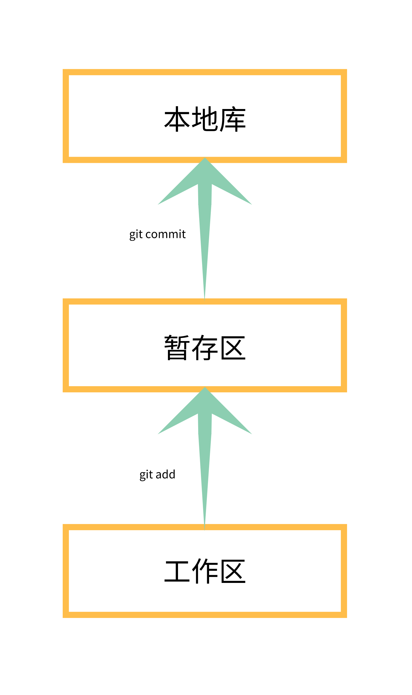
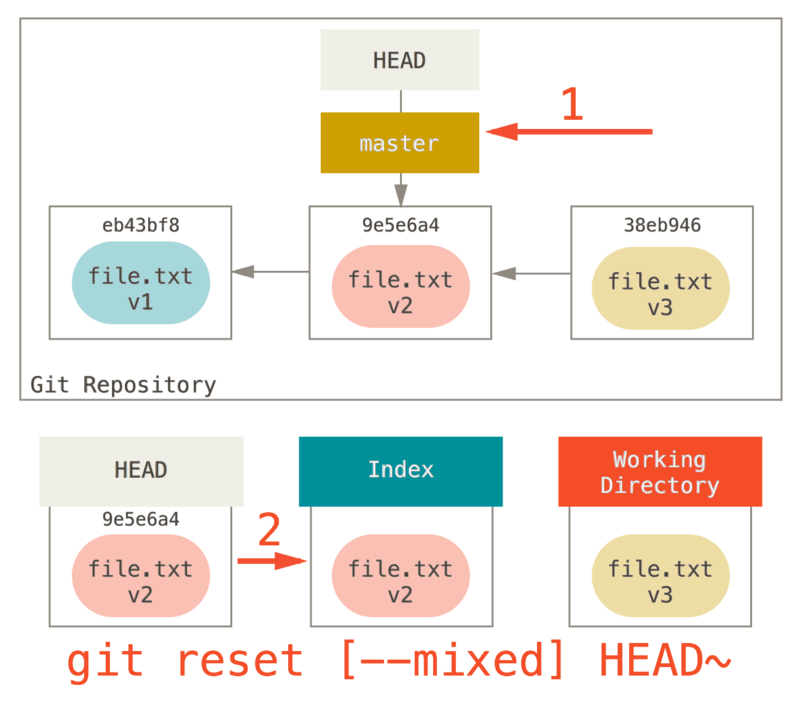

# git操作教程



## 基本命令

```
git init　初始化仓库
git init --bare 初始化裸仓库
git add <file> 将工作区文件添加到暂存区
git commit -m <message> 暂存区提交到本地库
git status 查看当前状态
git rm --cached 从暂存区移出
git mv README.md README 移动文件
git log --pretty=oneline 日志
git checkout -- <file>　撤销文件修改
git push [remote-name] [branch-name] 推送到某个仓库的某个分支
```

## 日志查看
```
git log 查看日志
git log --pretty=oneline    显示为一行
git log --oneline           显示为一行(hash值显示一部分)
git reflog                  显示HEAD位置
```

## 版本跳转 - [git reset命令](https://git-scm.com/book/zh/v2/Git-%E5%B7%A5%E5%85%B7-%E9%87%8D%E7%BD%AE%E6%8F%AD%E5%AF%86)

```git reset --soft```


```git reset --mixed```


```git reset --hard```


基于索引值跳转
```
git reset --hard [索引值]
git reset --hard 5cb677d
```
版本回退
```
git reset --hard HEAD^      回退一个版本
git reset --hard HEAD^^     回退两个版本
git reset --hard HEAD^^^    回退三个版本
git reset --hard HEAD~4     回退四个版本
```

git reset参数
```
--soft  仅仅在本地库移动HEAD指针
--mixed 本地库移动HEAD指针，重置暂存区
--hard  本地库移动HEAD指针，重置暂存区，重置工作区
```

## 差异对比
```
git diff <file>                     工作区和暂存区对比
git diff <本地库历史版本> <file>     工作区和本地库对比
git diff                            工作区和暂存区对比(所有文件)
```

## 分支操作
```
git branch -v                                       查看当前分支
git branch <branch name>                            创建分支
git checkout <branch name>                          切换分支
git merge <branch name>                             分支合并
git fetch <远程库别名> <远程库分支名>                 拉取远程库内容(不合并到本地库)
git pull                                            拉取(fetch + merge <远程库别名/远程分支名>)
```

## 保存现场

暂存区没有commit时，无法checkout到另一个分支，这时需要将当前工作stash后再切换。

stash list使用栈数结构，先入后出

```
git stash               保存现场
git stash list          查看保存的记录

git stash pop           还原最新保存记录并从stash list中删除

git stash apply         还原最新保存记录，不从stash list中删除
git stash drop          删除最新保存记录
```

## git搜索

```
git grep <str>          搜索str字符串
git grep -n <str>       搜索str字符串(显示行号)
git grep --count <str>  搜索str字符串(显示每个文件匹配数)
git grep -p <str> *.c   搜索str字符串(显示函数)
git grep --break <str>  搜索str字符串(两个文件中显示空行)
git grep --heading <str>搜索str字符串(文件名显示在上方)
```

## GitWeb 简易网页查看器

通过```git instaweb```命令启动web服务

支持apache2,lighttpd, mongoose, plackup and webrick服务器，默认为lighttpd

通过```git instaweb --httpd=webrick```命令指定web服务器

## git服务

使用 ```git daemon```命令搭建简单git服务，默认监听9418端口

初始化一个裸仓库(不带工作区)

```git init --bare /opt/git-repo/repo1.git```

```git daemon --verbose --export-all --reuseaddr --enable=receive-pack --base-path=/opt/git-repo/ /opt/git-repo/```

客户端使用```git clone git://localhost/repo1.git```检出仓库

## git api

编程方式使用git [libgit2](https://libgit2.org/) [jgit](https://www.eclipse.org/jgit/)

- [c](https://github.com/libgit2/libgit2)
- [c#](https://github.com/libgit2/libgit2sharp)
- [java](https://www.eclipse.org/jgit/)
- [python](https://github.com/libgit2/pygit2)
- [go](https://github.com/libgit2/git2go)

## github api

[github develop api](https://developer.github.com/v3/libraries/)

- [c#](https://github.com/octokit/octokit.net)
- [javascript](https://github.com/octokit/octokit.js)
- [python](https://github.com/PyGithub/PyGithub)
- [go](https://github.com/google/go-github)


## 缓存密码

参考[凭证存储](https://git-scm.com/book/zh/v2/Git-%E5%B7%A5%E5%85%B7-%E5%87%AD%E8%AF%81%E5%AD%98%E5%82%A8#r_credential_caching)

```git config --global credential.helper cache```

## git gc

```git gc```命令来优化本地库文件修订版

执行前 .git/objects目录下显示如下,00/  15/  2d/这样的目录为每次提交的sha1值
```
00/  15/  2d/  37/  48/  57/  62/  76/  85/  9a/  b3/  b8/  c8/  da/  info/
02/  1d/  31/  3a/  4f/  5c/  70/  82/  87/  a9/  b4/  bf/  cd/  ea/  pack/
05/  2b/  32/  41/  54/  5f/  72/  83/  88/  b0/  b6/  c4/  d3/  ee/
```
执行```git gc```后.git/objects目录下显示如下
```
info/  pack/
```
